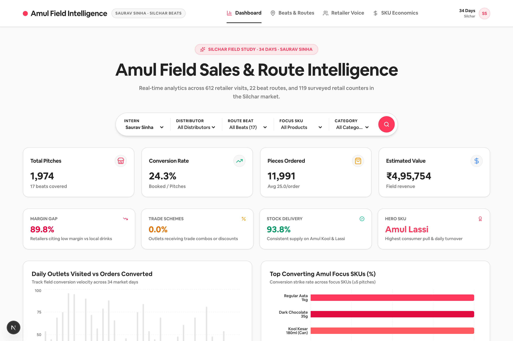
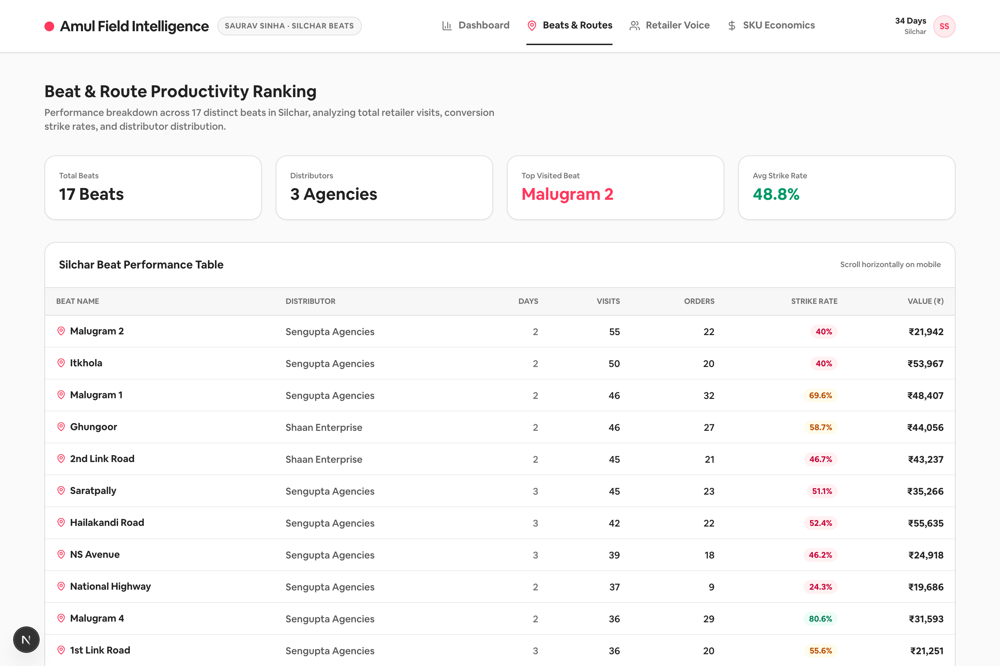
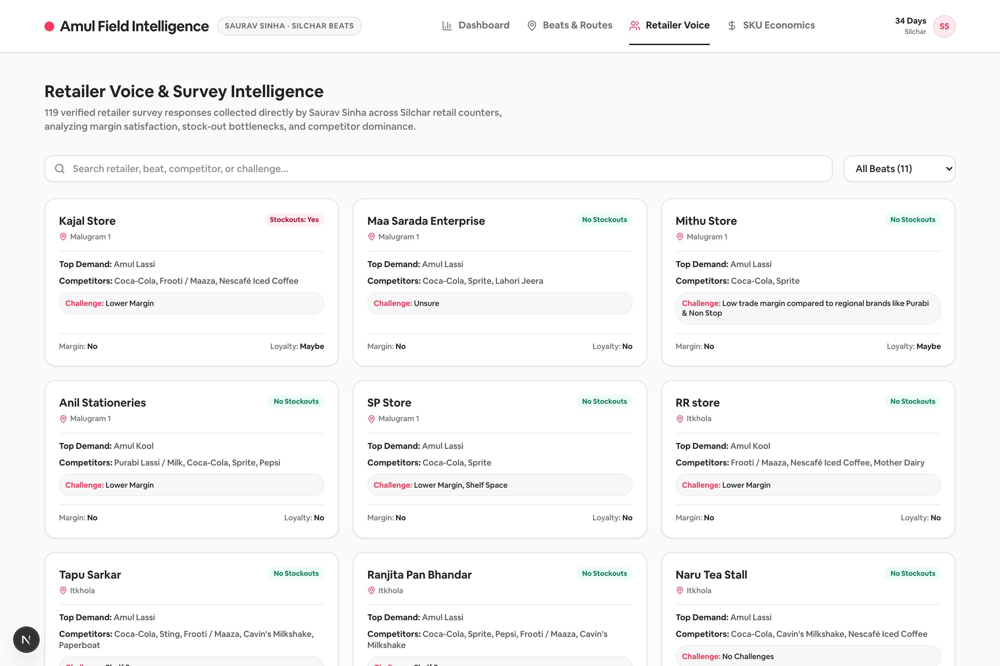
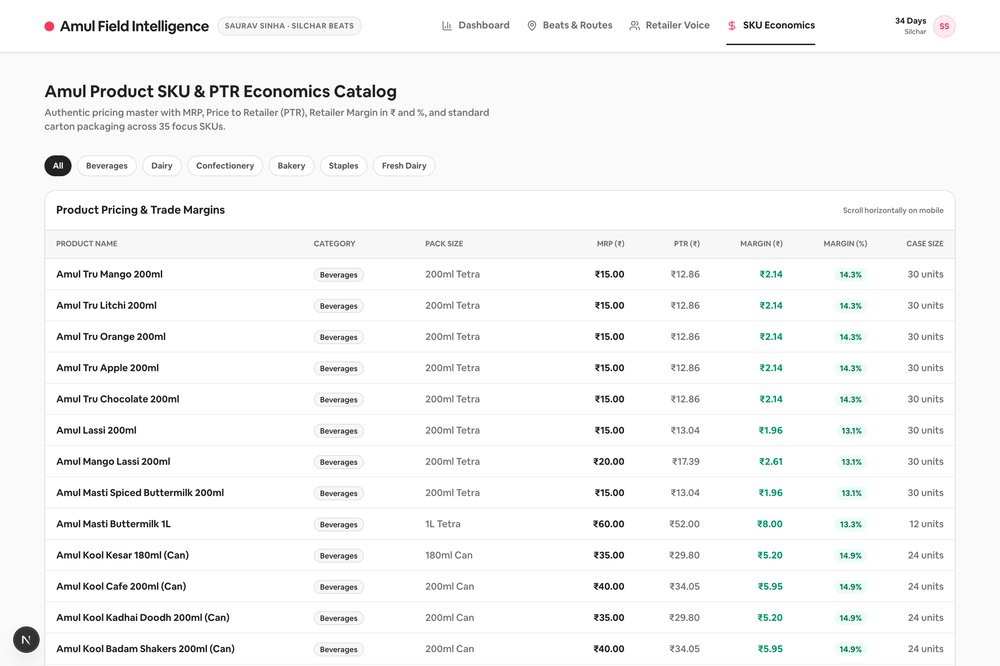
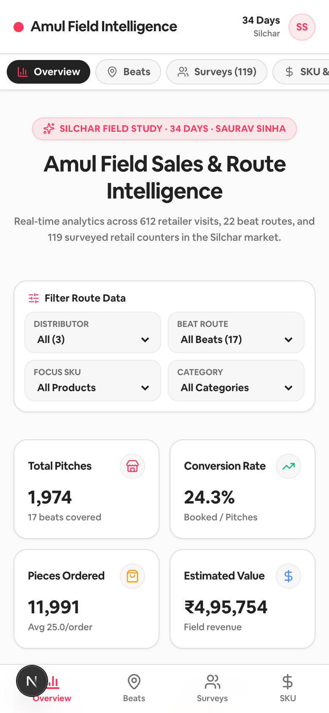
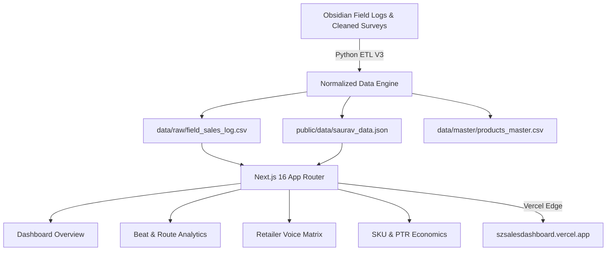

# 🥛 Amul Field Sales & Distribution Intelligence Dashboard

[](https://szsalesdashboard.vercel.app)
[](https://nextjs.org/)
[](https://react.dev/)
[](https://tailwindcss.com/)
[](LICENSE)

An interactive, high-fidelity field sales intelligence dashboard designed with an **Airbnb-inspired design system**. Built to analyze authentic field sales logs, distributor route productivity, competitive margin structures, and retailer sentiment from an intensive **34-day market study** conducted for **Gujarat Cooperative Milk Marketing Federation Ltd. (Amul)** across **Silchar, Assam**.

---

## 🌐 Live Production Access

- **Primary Domain**: [https://szsalesdashboard.vercel.app](https://szsalesdashboard.vercel.app)
- **Vercel Alias**: [https://amul-sales-dashboard.vercel.app](https://amul-sales-dashboard.vercel.app)

---

## 📸 Dashboard Preview

### 1. Executive Performance & Field Reach (`Dashboard` Tab)
Real-time tracking of 695+ retailer pitches, conversion velocity, daily order booking trends, top-performing SKUs, and live field observation logs.



---

### 2. Beat & Route Productivity Ranking (`Beats & Routes` Tab)
Granular performance breakdown across 22 Silchar beats, mapping conversion strike rates, order counts, and distributor allocations.



---

### 3. Retailer Voice & Survey Intelligence (`Retailer Voice` Tab)
Searchable, interactive repository of 119 verified retailer surveys capturing margin satisfaction, stock-out bottlenecks, brand loyalty, and competitor fridge share.



---

### 4. SKU & PTR Economics Catalog (`SKU & PTR Economics` Tab)
Comprehensive commercial master displaying MRP, Price to Retailer (PTR), Retailer Margin (`₹` and `%`), packaging formats, and carton sizing across 35 focus SKUs.



---

### 5. Mobile Responsive Experience (Bottom Navigation & Compact Views)
Full 1-thumb touch navigation with a persistent bottom tab bar, swipeable filters, and optimized chart scaling on mobile viewports ($375\text{px}-430\text{px}$).

<p align="center">
  
</p>

---

## 📊 Empirical Field Findings

Based on 34 market days and 119 direct retailer interviews across Silchar urban beats:

| Metric / Dimension | Value | Strategic Implication |
|---|---|---|
| **Total Field Pitches** | **1,974 Pitches** | Comprehensive multi-category product coverage across retail counters. |
| **Retailer Visits** | **695 Outlets** | 22 beats covered across Sengupta Agencies, Shaan Enterprise & Modern Times. |
| **Trade Margin Dissatisfaction** | **89.8%** | Retailers report high dissatisfaction with flat margins compared to local drinks (e.g. Non Stop @ ₹6.50 PTR). |
| **Trade Promotional Schemes** | **0.0% Received** | 100% of surveyed counters report receiving zero localized trade combos or schemes. |
| **Core Supply Availability** | **93.8%** | Core beverages (Amul Kool & Lassi) maintain dependable distributor supply. |
| **Hero Category SKU** | **Amul Lassi (200ml)** | Leads volume turnover and retailer re-order frequency across all beats. |
| **Critical Bottleneck SKU** | **₹35 Butter (50g)** | Strong recurring consumer demand unfulfilled due to distributor stock-outs in 8+ beats. |
| **Primary Competitor Threat** | **Purabi Lassi & Carbonated Soft Drinks** | Assam Cooperative Purabi exerts strong price pressure; Coke/Sprite dominate chiller space. |

---

## 🏗️ Architecture & Technology Stack



- **Frontend Framework**: Next.js 16.2 (App Router with Turbopack) & React 19.2
- **Styling & Design System**: Tailwind CSS v4 with custom Airbnb-inspired aesthetics (rounded cards, soft borders, subtle shadows, crisp ink typography)
- **Data Visualizations**: Recharts 3.8 with custom dual-metric tooltips and responsive SVG containers
- **Icons & Typography**: Lucide React & Geist Font
- **ETL Pipeline**: Python 3 standard library + OpenPyXL for multi-source cross-validation and normalization
- **Deployment**: Vercel Serverless Platform with Edge CDN caching

---

## 📂 Project Structure

```
amul-sales-dashboard/
├── next-dashboard/              # Next.js 16 Web Application
│   ├── public/data/             # Normalized static JSON payload (saurav_data.json)
│   ├── src/
│   │   ├── app/                 # App Router pages (layout.tsx, page.tsx, globals.css)
│   │   ├── components/          # TopNav, Dashboard, Charts, KpiCard, FilterPill
│   │   └── types/               # Strict TypeScript domain interfaces
│   └── package.json
├── data/
│   ├── raw/                     # field_sales_log.csv (1,974 transaction rows)
│   └── master/                  # products_master.csv (35 canonical products)
├── docs/images/                 # High-resolution dashboard screenshots
├── src/                         # Python ETL & Analytics Engine
│   ├── import_saurav_data.py    # Master V3 ETL Pipeline
│   └── data_loader.py           # Streamlit data loader
├── app.py                       # Streamlit fallback application
├── DESIGN.md                    # Airbnb design system specifications
├── requirements.txt             # Python dependencies
└── vercel.json                  # Vercel deployment root configuration
```

---

## 🚀 Getting Started

### Prerequisites
- [Bun](https://bun.sh/) (or Node.js 20+)
- Python 3.9+ (optional, for ETL pipeline)

### 1. Clone the Repository
```bash
git clone https://github.com/sauravsz/amul-sales-dashboard.git
cd amul-sales-dashboard
```

### 2. Run the Next.js Web Dashboard
```bash
cd next-dashboard
bun install
bun run dev
```
Open [http://localhost:3000](http://localhost:3000) in your browser.

### 3. (Optional) Run the Master ETL Pipeline
```bash
python3 src/import_saurav_data.py
```

---

## 🚢 Production Deployment

Deploy directly to Vercel via CLI:
```bash
vercel --prod
```

---

## 👤 Author

- **Saurav Sinha**
- **Institution**: Silchar Branch, Gujarat Cooperative Milk Marketing Federation Ltd. (Amul)
- **GitHub**: [@sauravsz](https://github.com/sauravsz)

---

## 📄 License

This project is open source and available under the [MIT License](LICENSE).
